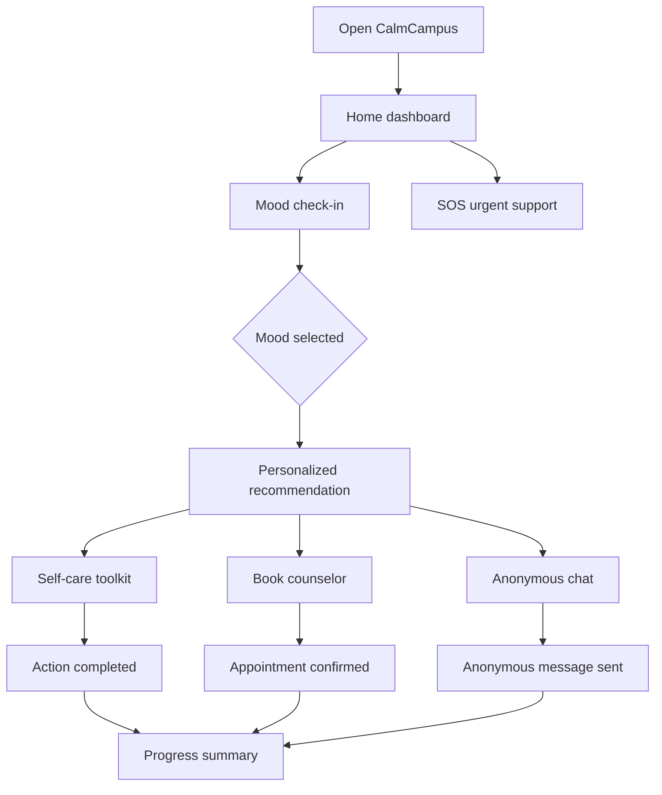

# CalmCampus Wireframes and User Flow

## Low-Fidelity Wireframe Plan

These wireframes can be drawn on paper, Balsamiq, Figma, or included as labeled boxes in the report.

## Screen 1: Home Dashboard

Purpose: Give stressed students fast access to help.

Layout:

```text
------------------------------------------------
CalmCampus                                SOS
Today
------------------------------------------------
Daily check-in
How are you feeling right now?
[ Start check-in ]

[ Self-care ]       [ Book counselor ]
[ Anonymous chat ]  [ Progress ]

Privacy note
------------------------------------------------
Bottom nav: Home | Care | Book | Chat | Progress
```

HCI rationale:

- The most important task, mood check-in, appears first.
- SOS is visible at the top for urgent support.
- Four main actions are presented as simple cards.

## Screen 2: Mood Check-In

Purpose: Let users express their current emotional state quickly.

Layout:

```text
Mood check-in
Tap the mood closest to how you feel.

[ Calm        steady and okay        ]
[ Stressed    too much to handle     ]
[ Anxious     worried or tense       ]
[ Low         sad or tired           ]
[ Overwhelmed need help now          ]

What may be contributing?
[ CATs/exams ] [ Money ] [ Relationships ]
[ Loneliness ] [ Group work ]

Check-in saved
[ Open self-care ]
```

HCI rationale:

- Uses recognition instead of recall.
- Mood options include text descriptions, not color alone.
- After selection, the system gives immediate feedback.

## Screen 3: Self-Care Toolkit

Purpose: Provide quick coping actions.

Layout:

```text
Self-care toolkit
Small actions for difficult moments.

[ 3-minute breathing     Start ]
[ Grounding exercise     Done  ]
[ Study stress reset     Done  ]

Feedback message appears after action.
```

HCI rationale:

- Exercises are short to match the user's stressed mental state.
- Actions are visible and easy to complete.
- Confirmation reinforces progress.

## Screen 4: Counselor Booking

Purpose: Make professional support easier to access.

Layout:

```text
Book counselor
Choose a private appointment slot.

Ms. Njeri W.
Student wellness counselor          Available

Available times
[ Tue 10:00 ] [ Tue 14:30 ]
[ Wed 09:00 ] [ Fri 11:30 ]

[ Confirm booking ]

Appointment confirmed
```

HCI rationale:

- Reduces uncertainty by showing available times.
- Prevents error by asking users to select a slot.
- Confirmation reassures the user.

## Screen 5: Anonymous Support Chat

Purpose: Let students seek support without fear of judgment.

Layout:

```text
Anonymous support
Safety note

Peer 12: What feels heavy today?
Me: I feel anxious about exams.
Peer 12: Would a grounding step help?

[ Type anonymously... ] [ Send ]
[ Report unsafe message ]
```

HCI rationale:

- Anonymous identity reduces stigma.
- Safety note builds trust.
- Report option supports moderation.

## Screen 6: Weekly Progress

Purpose: Help users recognize patterns and positive actions.

Layout:

```text
Weekly progress

Bar chart: Monday to Sunday mood trend

[ 5 check-ins ] [ 3 self-care actions ] [ 1 booking ]
```

HCI rationale:

- Uses simple visual summary instead of dense data.
- Helps students notice patterns without clinical language.

## User Journey Map

| Stage | User Action | User Feeling | Design Support |
|---|---|---|---|
| Trigger | Student feels anxious about exams | Worried, overwhelmed | Home screen offers quick check-in |
| Check-in | Student selects "Anxious" and reason | Slightly relieved | App confirms and recommends self-care |
| Support | Student starts breathing exercise | Calmer | Short exercise with simple instruction |
| Decision | Student decides they need more help | Nervous but ready | Booking screen shows available counselor slots |
| Confirmation | Student books appointment | Reassured | Confirmation message confirms date and time |
| Follow-up | Student checks weekly progress | More aware | Progress screen shows check-ins and actions |

## Core User Flow


